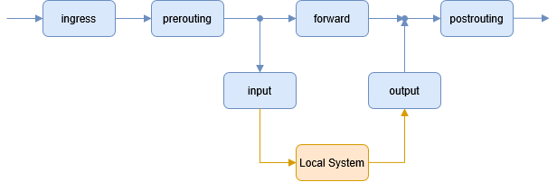
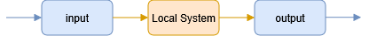
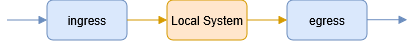
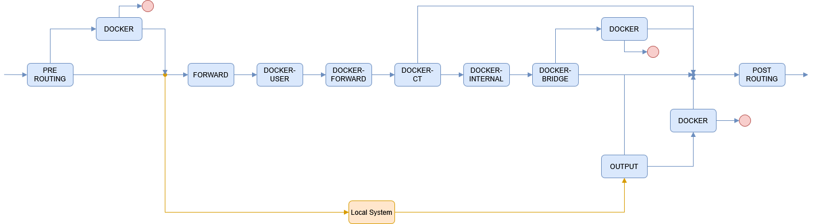

# `nft` コマンド

nftables を管理する。

## アドレスファミリ

アドレスファミリは下記が指定できる。

- ip (IPv4)
- ip6
- inet (IPv4/IPv6)
- arp
- bridge
- netdev

## フック

### ip / ip6/ inet / bridge

ip, ip6, inet, bridge では下記のフックが使用できる。



### arp

arp では下記のフックが使用できる。



### netdev

netdev では下記のフックが使用できる。



## `priority`

標準 `priority` の名前は下記がある。チェインは `priority` の昇順に優先される。

| 名前     | 値   | ファミリ                   | フック      |
| :------- | :--- | :------------------------- | :---------- |
| raw      | -300 | ip, ip6, inet              | all         |
| mangle   | -150 | ip, ip6, inet              | all         |
| dstnat   | -300 | bridge                     | prerouing   |
|          | -100 | ip, ip6, inet              | prerouing   |
| fileter  | -200 | bridge                     | all         |
|          | 0    | ip, ip6, inet, arp, netdev | all         |
| security | 50   | ip, ip6, inet              | all         |
| out      | 100  | bridge                     | output      |
| srcnat   | 100  | ip, ip6, inet              | postrouting |
|          | 300  | bridge                     | postrouting |

## ルールセット

### ルールセットの表示

IPv4 のルールセットを表示する。
ルールセットは複数のテーブルを含む。

```sh
sudo nft list ruleset ip
```

```text
 Warning: table ip nat is managed by iptables-nft, do not touch!
table ip nat {
        chain DOCKER {
        }

        chain PREROUTING {
                type nat hook prerouting priority dstnat; policy accept;
                fib daddr type local counter packets 1 bytes 52 jump DOCKER
        }

        chain OUTPUT {
                type nat hook output priority dstnat; policy accept;
                ip daddr != 127.0.0.0/8 fib daddr type local counter packets 0 bytes 0 jump DOCKER
        }

        chain POSTROUTING {
                type nat hook postrouting priority srcnat; policy accept;
                ip saddr 172.17.0.0/16 oifname != "docker0" counter packets 0 bytes 0 masquerade
        }
}
# Warning: table ip filter is managed by iptables-nft, do not touch!
table ip filter {
        chain DOCKER {
                iifname != "docker0" oifname "docker0" counter packets 0 bytes 0 drop
        }

        chain DOCKER-FORWARD {
                counter packets 0 bytes 0 jump DOCKER-CT
                counter packets 0 bytes 0 jump DOCKER-INTERNAL
                counter packets 0 bytes 0 jump DOCKER-BRIDGE
                iifname "docker0" counter packets 0 bytes 0 accept
        }

        chain DOCKER-BRIDGE {
                oifname "docker0" counter packets 0 bytes 0 jump DOCKER
        }

        chain DOCKER-CT {
                oifname "docker0" ct state related,established counter packets 0 bytes 0 accept
        }

        chain DOCKER-INTERNAL {
        }

        chain FORWARD {
                type filter hook forward priority filter; policy drop;
                counter packets 0 bytes 0 jump DOCKER-USER
                counter packets 0 bytes 0 jump DOCKER-FORWARD
        }

        chain DOCKER-USER {
        }
}
```

| テーブル | チェイン       | フック      | 優先度 | ルール                                                                                     |
| :------- | :------------- | :---------- | :----- | :----------------------------------------------------------------------------------------- |
| nat      | PREROUTING     | prerouting  | -100   | ローカルホストに転送されるパケットをカウントしチェイン DOCKER を呼び出す                   |
|          | OUTPUT         | output      | -100   | 127.0.0.1/8 以外のローカルホストに転送されるパケットをカウントしチェイン DOCKER を呼び出す |
|          | POSTROUTING    | postrouting | 100    | docker0 へ以外で 172.17.0.0/16 から転送されるパケットをカウントし送信元アドレスを変換する  |
| filter   | DOCKER         |             |        | docker0 以外から docker0 へのパケットをカウントし遮断する                                  |
|          | DOCKER-FORWARD |             |        | パケットをカウントしチェイン DOKCER-CT を呼び出す                                          |
|          |                |             |        | パケットをカウントしチェイン DOKCER-INTERNAL を呼び出す                                    |
|          |                |             |        | パケットをカウントしチェイン DOKCER-BRIDGE を呼び出す                                      |
|          |                |             |        | docker0 からのパケットをカウントし受容する                                                 |
|          | DOCKER-BRIDGE  |             |        | docker0 へのパケットをカウントしチェイン DOCKER を呼び出す                                 |
|          | DOCKER-CT      |             |        | docker0 への接続済みパケットをカウントし受容する                                           |
|          | FORWARD        | forward     | 0      | パケットをカウントしチェイン DOKCER-USER を呼び出す                                        |
|          |                |             |        | パケットをカウントしチェイン DOKCER-FORWARD を呼び出す                                     |

※ fib: Forwarding Information Base (パケット転送データベース)



## テーブル

### テーブルの表示

IPv4 のテーブルを表示する。

```sh
sudo nft list tables ip
```

```text
table ip nat
table ip filter
```

## チェイン

### チェインの表示

IPv4 のチェインを表示する。
チェインは複数のルールを含む。

```sh
sudo nft list chains ip
```

```text
table ip nat {
        chain DOCKER {
        }
        chain PREROUTING {
                type nat hook prerouting priority dstnat; policy accept;
        }
        chain OUTPUT {
                type nat hook output priority dstnat; policy accept;
        }
        chain POSTROUTING {
                type nat hook postrouting priority srcnat; policy accept;
        }
}
table ip filter {
        chain DOCKER {
        }
        chain DOCKER-FORWARD {
        }
        chain DOCKER-BRIDGE {
        }
        chain DOCKER-CT {
        }
        chain DOCKER-INTERNAL {
        }
        chain FORWARD {
                type filter hook forward priority filter; policy drop;
        }
        chain DOCKER-USER {
        }
}
```

## 参考

- [nftables の使用](https://docs.redhat.com/ja/documentation/red_hat_enterprise_linux/10/html/configuring_firewalls_and_packet_filters/getting-started-with-nftables)
