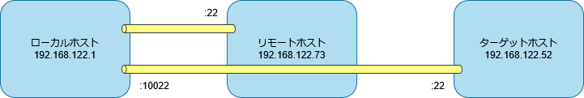
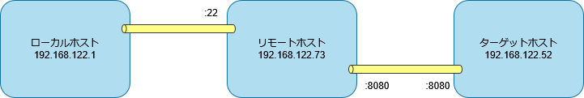

# `ssh` コマンド

SSH プロトコルで接続する。

```sh
ssh <リモートホスト>
```

## SSH 鍵の作成

公開鍵認証で接続するための SSH 鍵を作成する。

```sh
> ssh-keygen -t ed25519
```

ed25519 形式で *.ssh* ディレクトリにファイルが出力される。

```sh
> ls -l ~/.ssh/id_*
-rw-------. 1 root root 411  6月  1 15:01 /root/.ssh/id_ed25519
-rw-r--r--. 1 root root 103  6月  1 15:01 /root/.ssh/id_ed25519.pub
```

## SSH 公開鍵の転送

公開鍵を接続先に転送する。

```sh
ssh-copy-id 192.168.122.73
```

接続確認する。

```sh
> ssh -i ~/.ssh/id_ed25519 192.168.122.73 ls -l ~/.ssh
合計 4
-rw-------. 1 root root 103  6月  1 15:06 authorized_keys
```

## クライアント設定

ユーザごとの設定は *~/.ssh/config* に記載する。

リモートホスト 192.168.122.73 に公開鍵認証で接続する設定は下記となる。

```text
Host centos9
  Hostname 192.168.122.73
  User root
  IdentityFile ~/.ssh/id_ed25519
  IdentitiesOnly yes
```

接続確認する。

```sh
> ssh centos9 ls -l ~/.ssh
合計 4
-rw-------. 1 root root 103  6月  1 15:06 authorized_keys
```

## リモート制御

リモートホストでシェルを起動する。

```sh
ssh centos9
```

リモートホストでコマンドを実行する。

```sh
> ssh centos9 hostnamectl hostname
centos9.home.local
```

ローカルホストの標準出力をリモートホストの標準入力に接続する。

```sh
> echo Hello, World! | ssh centos9 cat
Hello, World!
```

リモートホストの標準出力をローカルホストの標準入力に接続する。

```sh
> ssh centos9 echo Hello, World! | cat
Hello, World!
```

ローカルホストにリダイレクトする。

```sh
> ssh centos9 echo Hello, World! > a.txt
> cat a.txt
Hello, World!
```

リモートホストにリダイレクトする。

```sh
> ssh centos9 'echo Hello, World! > a.txt'
> ssh centos9 cat a.txt
Hello, World!
```

中間サーバ centos9 を経由してリモートホストに接続する。

```sh
> ssh -J centos9 192.168.122.52 hostnamectl hostname
localhost
```

## ポートフォワード

ローカルホストのポートをターゲットホストのポートに転送する。
リモートホストとターゲットホストは同じホストでも問題ない。

```sh
> ssh -L 127.0.0.1:10022:192.168.122.52:22 centos9
Last login: Sun Jun  1 16:13:32 2025 from 192.168.122.1
```

別端末で接続確認する。

```sh
> ssh -p 10022 root@127.0.0.1 hostnamectl hostname
localhost
```



リモートホストのポートをターゲットホストのポートに転送する。

```sh
> ssh -R 8080:192.168.122.52:8080 centos9
Last login: Sun Jun  1 16:39:51 2025 from 192.168.122.1
```

リモートホスト上は 127.0.0.1 でバインドされるためリモートホスト上で接続確認する。

```sh
curl 127.0.0.1:8080
```

リモートホストの */etc/ssh/sshd_config* で `GatewayPorts` を `yes` に設定する。

```sh
> ssh -R 0.0.0.0:8080:192.168.122.52:8080 centos9
Last login: Sun Jun  1 16:39:51 2025 from 192.168.122.1
```

別端末で接続確認する。リモートホスト上のファイアウォールでポート番号 8080 を開けておく。

```sh
curl 192.168.122.73:8080
```



ローカルホストのポートで SOCKS サーバを起動する。

```sh
> ssh -D 127.0.0.1:8080 centos9
Last login: Sun Jun  1 17:27:42 2025 from 192.168.122.1
```

別端末で接続確認する。

```sh
curl --proxy socks5://127.0.0.1:8080 192.168.122.52:8080
```


